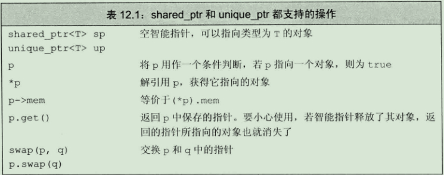
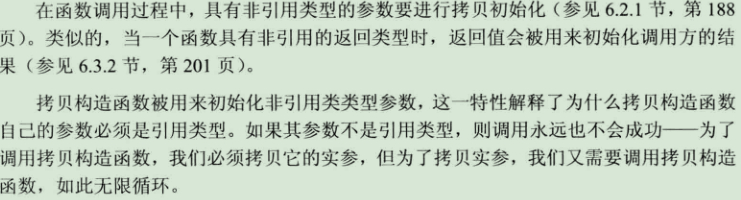
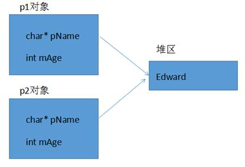

C++基础笔记

1. # 标准输入 cout<< 标准输出 cin>>  换行endl

2. # 动态内存分配：
   
   1. ## 向堆区申请一块空间，并返回一个指向这个空间的指针

```C%2B%2B
//申请一个int类型的空间
int *p = new int;
//释放空间
delete p;
//申请一个整型的数组
int *p = new int[3];
//首元素是整型的，因此声明一个整型的指针指向他
//释放的时候 前面要加[]
delete[] p;
//申请一个二维数组int[2][5] 首元素是个长度为5的一维数组 声明一个长度为5的指针数组
//来保存
int (*p)[5] = new int[2][5]
//释放
delete[] p;
```

1. ## 智能指针

为了更加安全的使用使用动态内存，c++11定一个两种智能指针，他们包含在memory的头文件中，分别是shared_ptr和unique_ptr。shared_ptr允许多个指针指向一个对象，而unique_ptr只能自己指向一个对象。



1. # 函数重载

是指函数的方法名相同，参数不同，根据不同的参数选择调用不同的函数。函数名相同 参数长度不同 参数类型不同 参数顺序不同 返回值不能作为重载的依据

## 重载的原理：

编译器为了实现函数重载，也是默认为我们做了一些幕后的工作，编译器用不同的参数类型来修饰不同的函数名，比如void func(); 编译器可能会将函数名修饰成_func，当编译器碰到void func(int x,char c),编译器可能会将函数名修饰为_func_int_char，不同的编译器可能会产生不同的内部名。

1. # 缺省函数参数

是指如果参数值确定的话，可以在函数中直接赋值，调用的时候就不用再填写值，但是缺省参数必须从租后一个开始写默认参数，从后向前写。

一个函数不能既是函数重载，又是缺省参数函数。

```C%2B%2B
void show(int a,int b,int c, int d = 4){
    cout<<a<<" "<<b<<" "<<c<<" "<<d" "<,endl;
}
//调用的时候可以这样
show(1,2,3); // d 默认赋值为4
```

1. # 引用：

引用就是给变量起别名。

- 引用不能为空

- 引用必须进行初始化

- 引用初始化后不能修改

可以为指针设置引用；可以定义指针数组但是不可以定义引用数组，可以定义数组引用。const 引用可使用相关类型的对象(常量,非同类型的变量或表达式)初始化。这个是 const 引用与普通引用最大的区别。const int &a=2;是合法的，而int &a = 2;是不合法的。

引用的本质是一个常指针，type * const p;

```C%2B%2B
 int a = 3;
int &Kk = a; //KK就是引用
int *p = &a;
int *&rp = p;//指针的引用
```

1. # 类：
   
   1. 将相同事物的特性抽象出来的模板， 用class关键字来定义
- 对象是类的一个实例化

- 类中定义了成员变量和成员方法

- 访问修饰符：public , private, protected，默认是private。

- 结构体和类的区别就是：结构体默认访问权限是public，类是private。

- 构造函数是用来初始化对象的，包括有参构造和无参构造，在定义对象的时候，默认调用，创建对象的时候没有参数，直接调用无参构造器，有参数的时候根据参数的不同而选择调用不同的有参构造器。

- 析构函数是在对象回收的时候调用的，自动回收类中new的空间
1. ## 构造和析构：

默认情况下，c++编译器至少为我们写的类增加3个函数

1．默认构造函数(无参，函数体为空)

2．默认析构函数(无参，函数体为空)

3．默认拷贝构造函数，对类中非静态成员属性简单值拷贝

如果用户定义拷贝构造函数，c++不会再提供任何默认构造函数，构造函数没有返回值。

如果用户定义了普通构造(非拷贝)，c++不在提供默认无参构造，但是会提供默认拷贝构造。



1. ## 深拷贝和浅拷贝：

同一类型的对象之间可以赋值，使得两个对象的成员变量的值相同，两个对象仍然是独立的两个对象，这种情况被称为**浅拷贝(等位拷贝)。**

拷贝构造函数，系统提供的是浅拷贝。

一般情况下，浅拷贝没有任何副作用，但是当类中有指针，并且指针指向动态分配的内存空间，析构函数做了动态内存释放的处理，会导致内存问题，导致一块内存被释放了两次。



当类中有指针，并且此指针有动态分配空间，析构函数做了释放处理，往往需要自定义拷贝构造函数，自行给指针动态分配空间，这就是深拷贝。


1. ## 初始化列表：

```C%2B%2B
Person(int a, int b, int c):mA(a),mB(b),mC(c){}
// 初始化成员列表(参数列表)只能在构造函数使用。
```

1. ## 类对象作为成员：

当调用构造函数时，首先按各对象成员在类定义中的顺序（和参数列表的顺序无关）依次调用它们的构造函数，对这些对象初始化，最后再调用本身的函数体。也就是说，先调用对象成员的构造函数，再调用本身的构造函数。析构函数和构造函数调用顺序相反。

1. ## 静态成员变量和静态成员函数：
- 类内静态成员类外初始化，通过类名来访问。

- 类的静态成员函数不能访问类的普通变量，只能访问静态成员变量。

- 在类内声明的static成员不占用类的大小。
1. ## this指针
- this指针是一种const修饰的常指针。

- this指针是隐含在对象成员函数内的一种指针。当一个对象被创建后，它的每一个成员函数都含有一个系统自动生成的隐含指针this，用以保存这个对象的地址，也就是说虽然我们没有写上this指针，编译器在编译的时候也是会加上的。因此this也称为“指向本对象的指针”，this指针并不是对象的一部分，不会影响sizeof(对象)的结果。

- this指针是C++实现封装的一种机制，它将对象和该对象调用的成员函数连接在一起，在外部看来，每一个对象都拥有自己的函数成员。一般情况下，并不写this，而是让系统进行默认设置。
  
  当形参和成员变量同名时，可用this指针来区分；在类的非静态成员函数中返回对象本身，可使用return *this；静态成员函数内部没有this指针，静态成员函数不能操作非静态成员变量。
1. ## 指向类成员的指针

2. # const：

C语言中const是伪常量，可以通过指针修改

C++中const会放入到符号表中

C语言中const默认是外部链接，C++中const默认是内部链接

1. ## const分配内存情况：

(1).对变量取地址，会分配临时内存

(2).extern关键字下的const会分配内存

(3).用普通变量初始化const变量

(4).自定义数据类型会分配内存

1. ## 常函数和常对象

常函数：用const修饰的成员函数时，const修饰this指针指向的内存区域，成员函数体内不可以修改本类中的任何普通成员变量，当成员变量类型符前用mutable修饰时例外。

常对象：常对象只能调用const的成员函数， 常对象可访问 const 或非 const 数据成员，不能修改，除非成员用mutable修饰。

如果const构成重载，const对象只能调用const修饰的函数，不是const修饰的对象，优先调用非const的函数。const对象只能调用const函数，非const修饰的对象可以调用const修饰的函数。类外定义的const函数，需要在声明处和定义处都要加上const。

```C%2B%2B
 //const修饰成员函数
class Person{
public:
    Person(){
        this->mAge = 0;
        this->mID = 0;
    }
    //在函数括号后面加上const,修饰成员变量不可修改,除了mutable变量
    void someOperate() const{
        //this->mAge = 200; //mAge不可修改
        this->mID = 10;
    }
    void ShowPerson(){
        cout << "ID:" << mID << " mAge:" << mAge << endl;
    }
private:
    int mAge;
    mutable int mID;
};
void test(){
    const Person person;//常对象
    //1. 可访问数据成员
    cout << "Age:" << person.mAge << endl;
    //person.mAge = 300; //不可修改
    person.mID = 1001; //但是可以修改mutable修饰的成员变量
    //2. 只能访问const修饰的函数
    person.someOperate();
}
```

1. # 单例模式

一个类只能有一个对象。将构造函数和拷贝构造函数全部设为private，设置一个静态指针变量，仅向外界提供静态指针变量的访问接口。

```C%2B%2B
 class Printer{ //打印机
public:
    // 外界访问的接口
    static Printer* getInstance(){ return pPrinter;}
private:
    Printer(){ mTimes = 0; }
    Printer(const Printer&){}
private:
    static Printer* pPrinter;
};

9.友元
friend关键字只出现在声明处
              其他类、类成员函数、全局函数都可声明为友元
友元函数不是类的成员，不带this指针
友元函数可访问对象任意成员属性，包括私有属性

                class Building{
    //全局函数做友元函数
    friend void CleanBedRoom(Building& building);
    //成员函数做友元函数
    friend void MyFriend::LookAtBedRoom(Building& building);
    friend void MyFriend::PlayInBedRoom(Building& building); 
    //友元类
    friend class MyFriend;
public:
    Building(){
        this->mSittingRoom = "客厅";
        this->mBedroom = "卧室";
    }
public:
    string mSittingRoom;
private:
    string mBedroom;
};
class MyFriend{//友元类
public：//友元成员函数
    void LookAtBedRoom(Building& building){
        cout << "我的朋友参观" << building.mBedroom << endl;
    }
    void PlayInBedRoom(Building& building){
         cout << "我的朋友玩耍在" << building.mBedroom << endl;
    }
};
//友元全局函数
void CleanBedRoom(Building& building){
    cout << "友元全局函数访问" << building.mBedroom << endl;
}
int main(){

    Building building;
    MyFriend myfriend;

    CleanBedRoom(building);
    myfriend.LookAtBedRoom(building);
    myfriend.PlayInBedRoom(building);
    system("pause");
    return 0;
}
```

## **[友元类注意]**

1. 友元关系不能被继承。

2. 友元关系是单向的，类A是类B的朋友，但类B不一定是类A的朋友。

3. 友元关系不具有传递性。类B是类A的朋友，类C是类B的朋友，但类C不一定是类A的朋友。

4. # 继承
   
   1. ## 三种继承方式：

public ：    公有继承

private ：   私有继承

protected ： 保护继承

从继承源上分： 

单继承：指每个派生类只直接继承了一个基类的特征

多继承：指多个基类派生出一个派生类的继承关系,多继承的派生类直接继承了不止一个基类的特征。

1. ## 继承中的构造和析构

构造的时候：先调用父类的构造函数， 再调用子类的构造函数

析构的时候：先调用子类的析构函数，再调用父类的析构函数


1. ## 多继承

```C%2B%2B
                class Son : public Father1, public Father2{};//多继承的一个示例 
```

多继承会带来一些二义性的问题。

1. ## 虚基类

虚基类中有一个vbptr(虚基类指针)，这个指针指向了虚基类表。


1. # 多态
   
   1. ## 含义：

父类指针指向子类对象

虚基类中有一个虚函数表指针(vfptr), 虚函数表指针指向了一张虚函数表。C++动态多态性是通过虚函数来实现的，虚函数允许子类重写父类成员函数。c++要求在基类中声明这个函数的时候使用virtual关键字。

静态联编：函数重载 发生在编译时期；

动态联编：虚函数 父类的指针调用不同的子类方法 发生在运行时期。

1. ## virtual用法：
- 在这个函数声明前面加上virtual关键字，定义时候不需要.

- 如果一个函数在基类中被声明为virtual，那么在所有派生类中它都是virtual的.

- 在派生类中virtual函数的重定义称为重写(override).

- virtual关键字只能修饰成员函数.

- 构造函数不能为虚函数
1. ## 纯虚函数

在设计时，常常希望基类仅仅作为其派生类的一个接口。做到这点，可以在基类中加入至少一个纯虚函数,使得基类称为抽象类。

纯虚函数使用关键字virtual，并在其后面加上=0。如果试图去实例化一个抽象类，编译器则会阻止这种操作。

1. ## 虚析构和纯虚析构

普通的析构函数是不会调用子类的析构函数的，所以可能会导致内存泄漏。因此，要使用虚析构。虚析构函数是为了解决[基类](http://baike.baidu.com/view/535539.htm)的[指针](http://baike.baidu.com/view/159417.htm)指向派生类对象，并用基类的指针删除派生类对象。

如果类的目的不是为了实现多态，作为基类来使用，就不要声明虚析构函数，反之，则应该为类声明虚析构函数。

1. # 两个类的头文件互相包含的问题

```C%2B%2B
//文件A.h中的代码 
#pragma once 
#include "B.h" 
class A {  
public: 
    B b;  
};     
//文件B.h中的代码 
#pragma once 
#include "A.h" 
class B  {  
public: 
    A a;  
}
```

这样是无法通过编译的，其原因是它们的头文件互相包含了，你包含我，我又包含你。

如果在A类中使用了B类的对象，那么就必须包含B类的头文件，而B类中就不能使用A类的对象了，这时就可以用对象的指针，用对象的指针，可以作简单的声明即可代替头文件的包含。也可以两个类中互相使用了对方的指针，这样的情况很简单，分别在各自的头文件中声明一下使用的类，而在各自的源文件中包含对方的头文件即可。

```C%2B%2B
 #pragma once 
#include "B.h"         //使用了B类的对象，所以要包含头文件   
class A {  
public: 
    B b;              
};  
 //文件B.h中的代码 
 #pragma once 
class A;        //使用了A类对象的指针，只做简单的声明即可
class B {  
public: 
  A* a; /////////////
};
```

1. # 运算符重载
   
   1. 重载的运算符的结合律和优先级跟原先的相同。不能被重载的运算符有：


1. 前置递增递减运算符和后置递增递减运算符

​    


1. 类中重载赋值运算符

```C%2B%2B
类名
{
    类名& operator=(const 类名& 源对象){
        拷贝体
    }
}
```

重载不能改变运算符运算对象（即操作数）的个数。

重载不能改变运算符的优先级别。

重载不能改变运算符的结合性。

重载运算符的函数不能有默认的参数

1. # 模板

函数模板，实际上是建立一个通用函数，其函数类型和形参类型不具体制定，用一个虚拟的类型来代表。这个通用函数就成为函数模板。凡是函数体相同的函数都可以用这个模板代替，不必定义多个函数，只需在模板中定义一次即可。在调用函数时系统会根据实参的类型来取代模板中的虚拟类型，从而实现不同函数的功能。函数模板不会进行隐式类型转换。c++提供两种模板机制:函数模板和类模板。

1. # 智能指针

https://www.cnblogs.com/wangkeqin/p/9351191.html